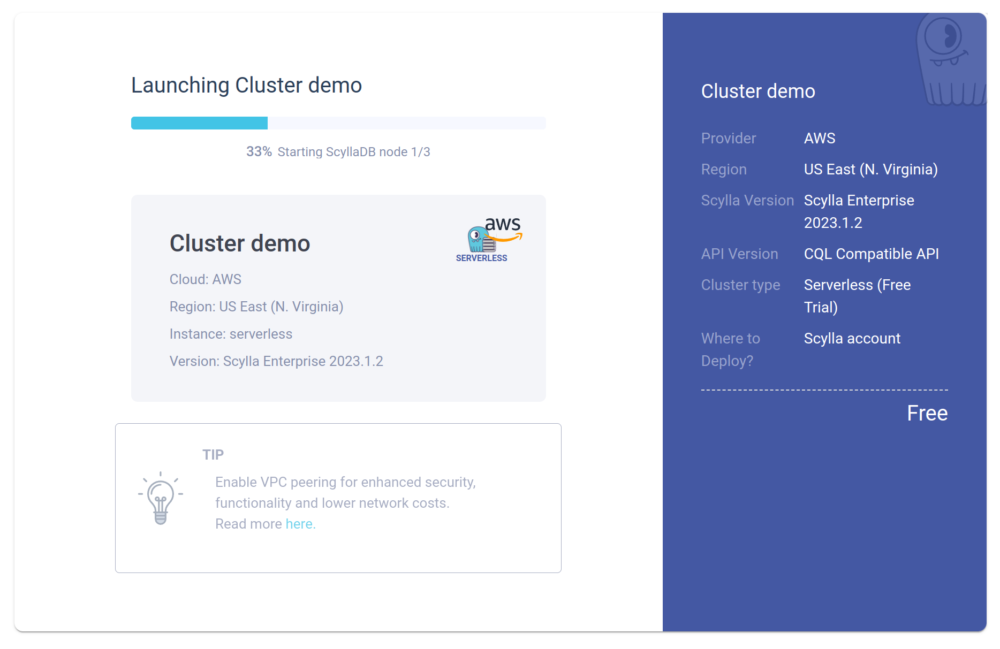
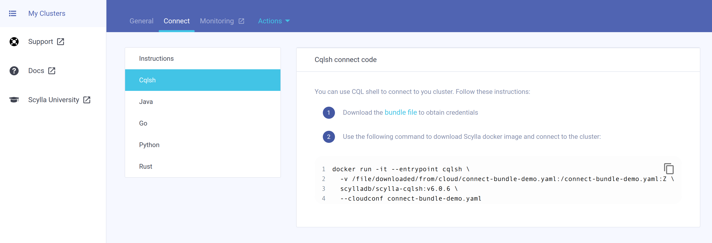

====================
Using ScyllaDB Cloud
====================

Run on ScyllaDB Cloud
---------------------

ScyllaDB Cloud is a fully managed service offering hassle-free deployment and maintenance of ScyllaDB clusters. It provides scalability, high availability, and secure database solutions without the need for manual setup or extensive database administration. This service is ideal for developers seeking a cloud-based, ready-to-use ScyllaDB solution.

The easiest way to get started with ScyllaDB Cloud is to sign up for a `free trial account <https://cloud.scylladb.com//>`_.

Running a Cluster
=================

You can run a serverless cluster which grants you 96 free credit hours, for 1 processing unit and up to 249GB of storage. This lets you try Scylla Enterprise and includes all enterprise features, which is useful if you intend to run your own proof of concept prior to purchasing ScyllaDB.

Connecting to your Cluster
==========================

You can connect to your node with CQLSH using the following command:

You will need to first download your bundle file to obtain your credentials. Look in your cloud console under My Clusters -> Connect

You can then use Docker to connect to your cluster, making sure to modify the path to your credentials bundle with a command similar to:

.. code-block:: none

  docker run -it --entrypoint cqlsh \
    -v </path/to/your/connect-bundle.yaml>:/connect-bundle.yaml:Z \
    scylladb/scylla-cqlsh:v6.0.6 \
    --cloudconf connect-bundle.yaml